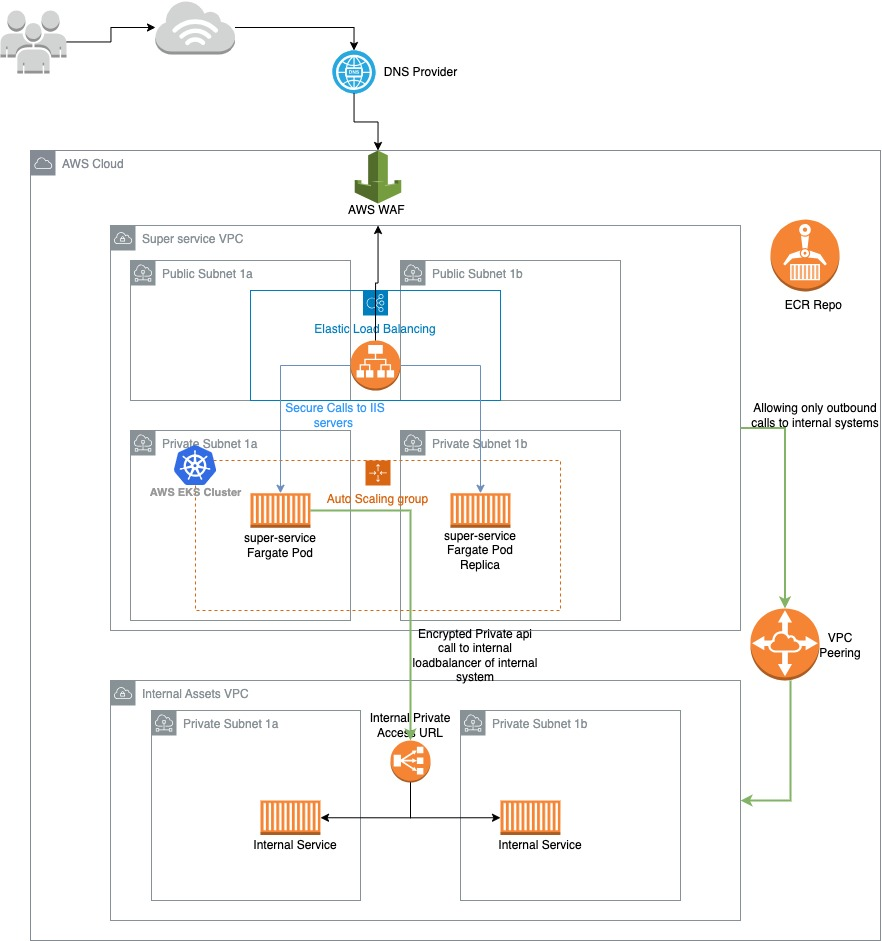

# super-service
Sample dotnet code for executing the dotnet build and packaging tasks


## Usage

### Prerequisites
1. Install Dotnet core v3.1 version with cli and runtime. 
2. Install latest Docker Desktop/CE

### Local execution

Build, test and run the code locally by running the powershell script `Deploy.ps1` 
OR 
Follow individual commands below. 
1. Run test `dotnet test`
2. Build project dependencies `dotnet restore`
3. Package the build `dotnet publish -c Release -o out`
4. Run the packaged file `dotnet out/SuperService.dll`


### Packaging in Docker image

Build the docker image using the `Dockerfile`   

```
docker build . -t superservice:v1 
```

After successfull build, run the image locally with command below 

```
docker run -d --name super-service -p 80:80 -p 5000:5000 -p 5001:5001 -p 18709:18709 -p 44349:44349 superservice:v1 
```

Verify the container logs 

```
docker logs super-service 
```

Access container on localhost by making the api call. 


## Deploying the application on AWS cloud. 

Cloud:  AWS  

Kubernetes : AWS EKS service  
Loadbalancing : AWS ALB  
Private access : VPC peering   
Web Security : AWS WAF  


For deploying the super-service as a docker container in kubernets cluster, I will choose the AWS EKS service for container orchestration. Major reason is to have a managed service with fully backend for kubernetes masters





1. Dotnet App Containerization:

Description: This section outlines the process of packaging the Dotnet application along with IIS configuration, enabling SSL for secure encrypted API calls.

Justification : Enabling SSL ensures that all data transmitted between the client and the server is encrypted, protecting it from interception by attackers. By containerizing the application, we ensure that it runs in isolated environments, enhancing security and reducing the risk of vulnerabilities.

2. Kubernetes Deployment:

Description: Here, we describe the deployment of the containerized application using Kubernetes deployment in an EKS cluster. The deployment manifest includes environment variables required to override non-prod and prod environment configurations. Sensitive configurations like SSL certificates are stored as Kubernetes secrets and mounted as volume mounts in the container's file system.

Justification : Using Kubernetes for deployment provides scalability and flexibility while ensuring security. Storing sensitive information like SSL certificates as Kubernetes secrets protects them from exposure. Mounting them securely as volume mounts ensures that they are accessible only by authorized containers, reducing the risk of unauthorized access.

3. K8s Cluster:

Description: AWS EKS cluster provides container orchestration with managed master nodes. It supports Fargate nodes for serverless workload deployment. Fargate is a fully managed node provisioner where no host access is provided, enhancing security by minimizing attack surface.

Justification : Using managed services like EKS and Fargate reduces the burden of managing infrastructure, ensuring that the underlying infrastructure is secure and up-to-date. With Fargate, there is no need to manage nodes, reducing the risk of misconfigurations or vulnerabilities.

4. Service Access:

Description: Kubernetes service is exposed outside the cluster using the service type LoadBalancer. The AWS Load Balancer Controller provisions the load balancer in AWS ELB service. The load balancer has a 443 listener with an ACM certificate for SSL termination of web calls coming from the internet.

Justification : By using a load balancer with SSL termination, we ensure secure communication between clients and the application. The AWS WAF service configured with the Application Load Balancer provides protection from DDOS, XSS, and other web threats, enhancing overall web security.

5. Web Security:

Description: The Application Load Balancer provisioned above has AWS WAF service configured to provide protection from web threats.

Justification : 
AWS WAF offers comprehensive web security features that enhance the overall security posture of the application. In addition to protection from DDOS and XSS attacks, AWS WAF provides several other benefits:

* SQL Injection Protection: AWS WAF can detect and block SQL injection attacks, safeguarding the application from unauthorized access to databases and sensitive information.

* Bot Mitigation: AWS WAF includes bot mitigation capabilities to identify and block malicious bots, preventing them from consuming resources, scraping content, or carrying out other malicious activities.

* Geo-Blocking: AWS WAF allows for the blocking of traffic based on geographic location, helping to mitigate threats from specific regions known for malicious activity or compliance requirements.

* Rate Limiting: AWS WAF can enforce rate limits on incoming requests to protect against brute force attacks and other types of abuse that attempt to overwhelm the application with excessive traffic.

* Custom Rules: AWS WAF enables the creation of custom rules based on specific application requirements or security policies, providing flexibility to address unique threats or vulnerabilities.

* Integration with AWS Services: AWS WAF seamlessly integrates with other AWS services such as Amazon CloudFront and AWS Shield, providing a comprehensive defense-in-depth strategy for protecting web applications against a wide range of threats.


6. Communication with Internal Assets Services:

Description: This section describes communication with internal asset services hosted in a dedicated VPC network or private cloud. It outlines the use of VPC peering for private tunnel communication and restricting access to specific IP addresses.

Justification : By using VPC peering, we establish secure communication channels between different VPCs, ensuring that communication between the application and internal assets services is encrypted and isolated from external threats. Restricting access to specific IP addresses further enhances security by limiting access to authorized entities only.
